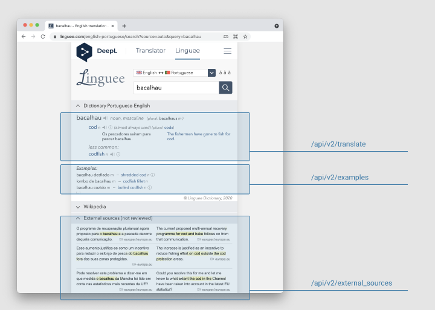

# Linguee API

[Linguee](https://linguee.com) provides excellent dictionary and translation memory service. Unfortunately, there is no way you can get automated access to it. Linguee API fixes the problem. It acts as a proxy and converts their HTML responses to easy-to-use JSON API.

## API endpoints

The proxy provides three API endpoints: for translations, for examples, and external sources.



The API documentation and the playground is available for the sample installation:

- [Documentation and API playground](https://linguee-api-v2.herokuapp.com/docs)
- [The same documentation, but formatted with ReDoc](https://linguee-api-v2.herokuapp.com/redoc)

## Sample installation

Sample installation is available at https://linguee-api-v2.herokuapp.com.

- Get translations of the word "bacalhau" from Portuguese to English: [https://linguee-api-v2.herokuapp.com/api/v2/translations?query=bacalhau&src=pt&dst=en](https://linguee-api-v2.herokuapp.com/api/v2/translations?query=bacalhau&src=pt&dst=en).
- Get a list of curated examples: [https://linguee-api-v2.herokuapp.com/api/v2/examples?query=bacalhau&src=pt&dst=en](https://linguee-api-v2.herokuapp.com/api/v2/examples?query=bacalhau&src=pt&dst=en).
- Get examples from external sources: [https://linguee-api-v2.herokuapp.com/api/v2/external_sources?query=bacalhau&src=pt&dst=en](https://linguee-api-v2.herokuapp.com/api/v2/examples?query=bacalhau&src=pt&dst=en).

[](https://heroku.com/deploy)

## Local installation

Install the Linguee API.

```shell
$ pip install linguee-api
```

Run the API server with `uvicorn` (installed as a dependency.)

```shell
$ uvicorn linguee_api.api:app
...
INFO:     Uvicorn running on http://127.0.0.1:8000 (Press CTRL+C to quit)
...
```

Open http://127.0.0.1:8000. You will be redirected to the API documentation page, where you can test the API.

## Supported languages

API supports all the languages, supported by Linguee. As in Linguee, not all language pairs are valid though. Supported languages:
`bg` (Bulgarian), `cs` (Czech), `da` (Danish), `de` (German), `el` (Greek), `en` (English), `es` (Spanish), `et` (Estonian), `fi` (Finnish), `fr` (French), `hu` (Hungarian), `it` (Italian), `ja` (Japan),`lt` (Lithuanian), `lv` (Latvian), `mt` (Maltese), `nl` (Dutch), `pl` (Polish), `pt` (Portuguese), `ro` (Romanian), `ru` (Russian), `sk` (Slovak), `sl` (Solvene), `sv` (Swedish), `zh` (Chinese).

## Response structure

**Lemmas**

Every query (a random string) can match several so-called lemma objects.

According to Wikipedia, [lemma](https://en.wikipedia.org/wiki/Lemma_(morphology)) is the canonical form, dictionary form, or citation form of a set of words.

In English, for example, break, breaks, broke, broken, and breaking are forms of the same lexeme, with "break" as the lemma by which they are indexed.

In the API, lemmas have the only required attribute, "text," but may have optional elements, such as part of speech ("pos") and audio links with pronunciations.


**Translations**

Every lemma has one or more translations. The translation is a lemma in a different language and has a similar structure with the necessary text field and optional part of speech and audio links.


**Examples**

In addition to lemmas, the API returns several usage examples curated by dictionary authors. Examples are the short phrases, annotated with one or more equivalents in different languages. When appropriate, examples may contain the part-of-speech form and audio links.

**External Sources**

On top of curated examples, Linguee provides links to external sources. The API returns objects containing the phrase snipped in the original language and an equivalent snippet in the translation.

## Usage examples with Python and requests

Once installed on Heroku, Linguee API can be used as any other API service. I recommend using the [requests](https://docs.python-requests.org/) library.

### Translate a word or a phrase from one language to another with Python

A request to the sample API installation to translate the word "bacalhau" from Portuguese to English.

```python
import requests

api_root = "https://linguee-api-v2.herokuapp.com/api/v2"
resp = requests.get(f"{api_root}/translations", params={"query": "bacalhau", "src": "pt", "dst": "en"})
for lemma in resp.json():
    for translation in lemma['translations']:
        print(f"{lemma['text']} -> {translation['text']}")
```

This will print:

```
bacalhau -> cod
bacalhau -> codfish
```

### Provide translation examples with Python

A request to the sample API installation to get all usage examples of "bacalhau" along with their translations.

```python
import requests

api_root = "https://linguee-api-v2.herokuapp.com/api/v2"

resp = requests.get(f"{api_root}/examples", params={"query": "bacalhau", "src": "pt", "dst": "en"})

for example in resp.json():
    for translation in example["translations"]:
        print(f"{example['text']} -> {translation['text']}")
```

This will print:

```
bacalhau desfiado -> shredded cod
lombo de bacalhau -> codfish fillet
...
bacalhau do Atlântico -> Atlantic cod
```

### Get access to real world usage examples with Python

A request to the sample API installation to get all real-world usage examples of "bacalhau" along with their translations.

```python
import requests

api_root = "https://linguee-api-v2.herokuapp.com/api/v2"

resp = requests.get(f"{api_root}/external_sources", params={"query": "bacalhau", "src": "pt", "dst": "en"})
for source in resp.json():
    print(f"{source['src']} -> {source['dst']}")
```

This will print a long list of real-world examples like this:

```
É calculado o esforço de [...] pesca de todos os navios que capturam bacalhau. -> The fishing effort of all [...] the vessels catching cod will be calculated.
```


## Bash, curl and jq usage example

Once installed on Heroku, Linguee API can be used as any other API service.

For Bash scripts you can use curl and [jq](https://stedolan.github.io/jq/), a command-line JSON parser.

### Translate a word or a phrase from one language to another with Bash

A request to the sample API installation to get all usage examples of "bacalhau" along with their translations.

```bash
curl -s 'https://linguee-api-v2.herokuapp.com/api/v2/translations?query=bacalhau&src=pt&dst=en' | jq -c '{text: .[].text, translation: .[].translations[].text}'
```

This will print

```json lines
{"text":"bacalhau","translation":"cod"}
{"text":"bacalhau","translation":"codfish"}
```

### Provide translation examples with Bash

A request to the sample API installation to get all usage examples of "bacalhau" along with their translations.

```shell
curl -s 'https://linguee-api-v2.herokuapp.com/api/v2/examples?query=bacalhau&src=pt&dst=en' | jq -c '{text: .[].text, translation: .[].translations[].text}'
```

This will print something like this:

```json lines
{"text":"bacalhau desfiado","translation":"shredded cod"}
{"text":"bacalhau desfiado","translation":"codfish fillet"}
...
{"text":"bacalhau do Atlântico","translation":"Atlantic cod"}
```

### Get access to real world usage examples with Bash

A request to the sample API installation to get all real-world usage examples of "bacalhau" along with their translations.

```shell
curl -s 'https://linguee-api-v2.herokuapp.com/api/v2/external_sources?query=bacalhau&src=pt&dst=en' | jq -c '{src: .[].src, dst: .[].dst}'
```

This will print a long list of real-world examples like this:

```json lines
{"src":"É calculado o esforço de [...] pesca de todos os navios que capturam bacalhau.","dst":"The fishing effort of all [...] the vessels catching cod will be calculated."}
...
```

## Terms and Conditions

If you use the API, make sure you comply with
[Linguee Terms and Conditions](http://www.linguee.com/page/termsAndConditions.php),
and in particular with that clause:

> Both private and business usage of linguee.com services is free of charge.
> It is however strictly prohibited to forward on our services to third
> parties against payment
